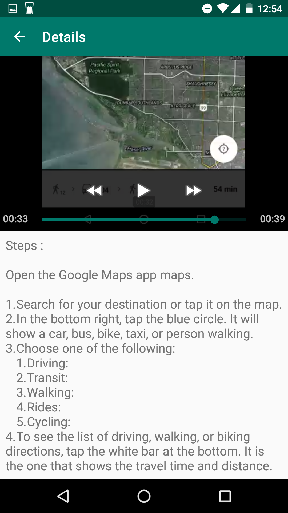
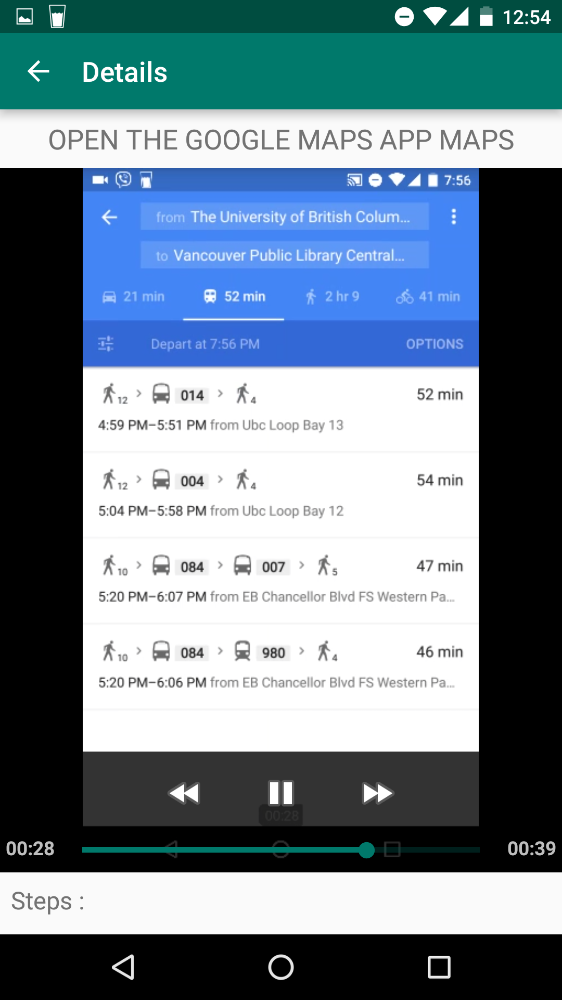
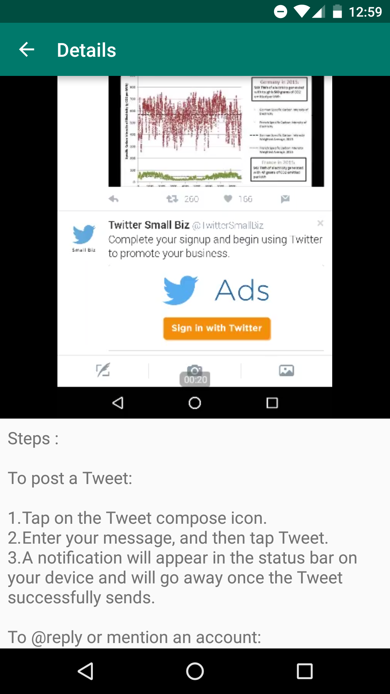
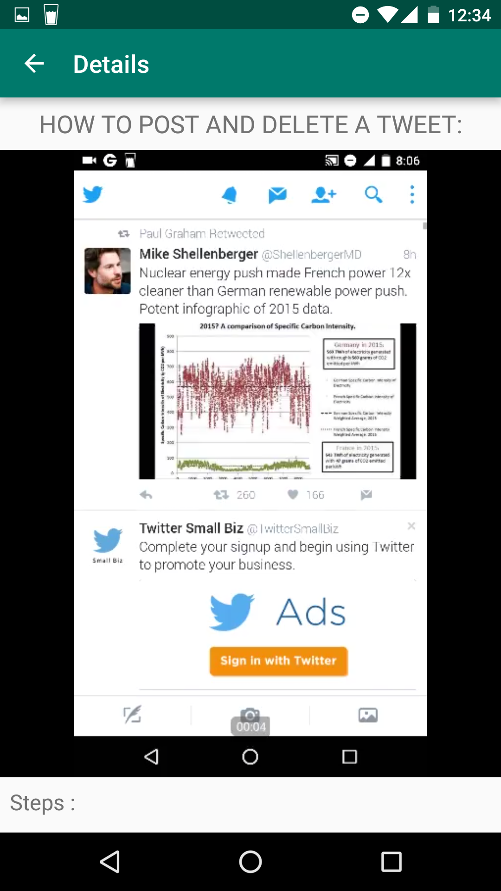
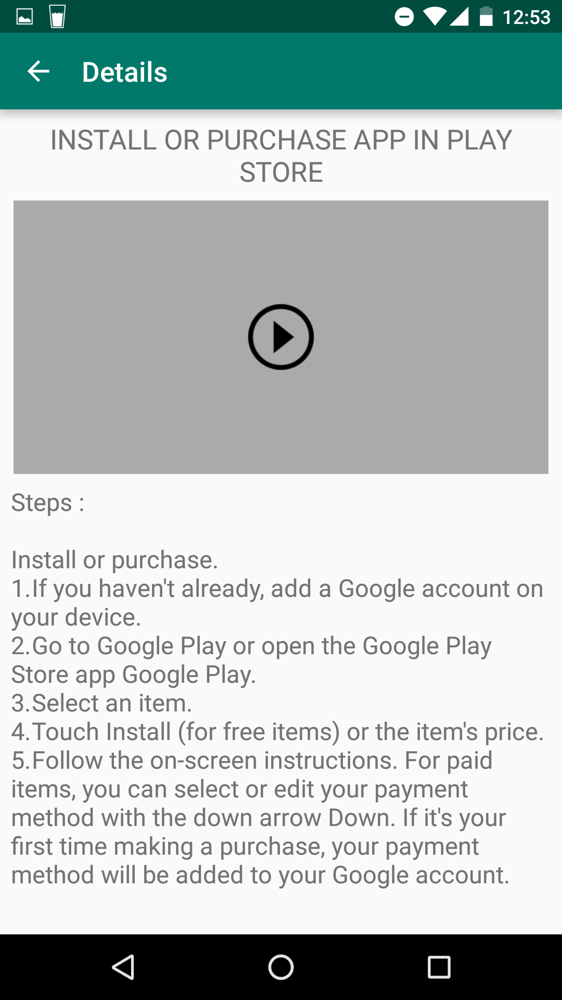

# senior-tech-help 

<b>Idea:</b>
An app that helps seniors with learning to use other famous mobile apps.

<b>Idea Origin:</b>
My parents and older relatives regularly consult me if they get stuck when using any mobile applications.
Many a times they have questions when their phone stop working as desired, which may be due to user error. 
This seems to be a common problem with seniors for whom it might not be intuitive to use many of the famous mobile applications.
It usually tough to remotely help them navigate through apps. So I thought of creating an app, 
which helps them with usual tasks that they might want to do on the famous apps like Facebook, Twitter, Hangout, Google Maps etc.

<b>Current prototype:</b>
This is still an initial prototype of the idea which includes steps to do the tasks in both text and video format.
I intentionally kept the icons big for them to be able to recognize easily.
I kept steps for multiple apps together at one place so that the users don’t have search at multiple places to get help. 
I understand that just the videos and text might not be enough for the elderly end user. 
However in future I want to take the app to a next level and want to add voice instructions which guides them step by step. 
The app will incorporate options mechanism for feedback.

<b>Snapshots: (version 1.0)</b>
 <i>P.S:All the icons used in project are trademark and copyright of the owner companies.</i>

